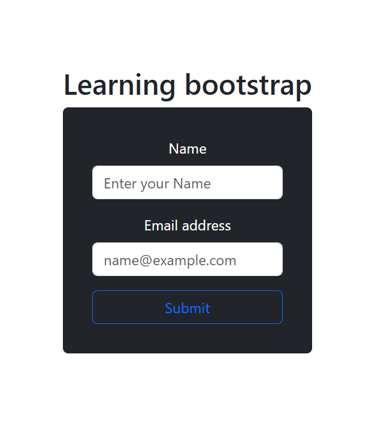
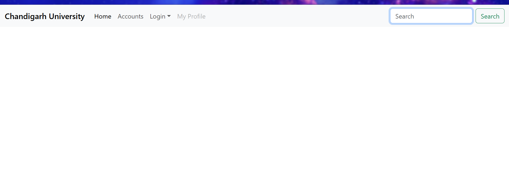

## Screenshots

<<<<<<< HEAD

=======
## Learning Outcomes

Through this experiment, I learned the concept of Single Page Applications and how to build a responsive frontend using Bootstrap and Material UI. I understood component-based development, routing, and basic state management in React. This experiment enhanced my understanding of modern UI/UX principles and frontend application structure.
>>>>>>> 27ff186 (LO)
