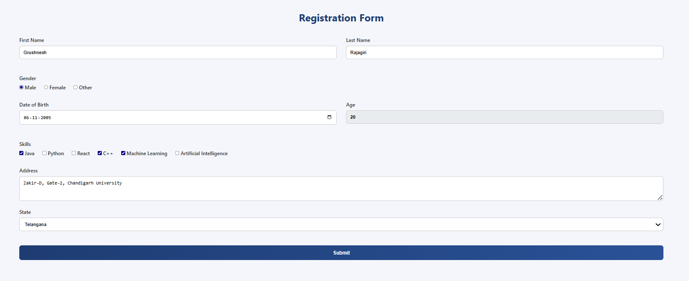
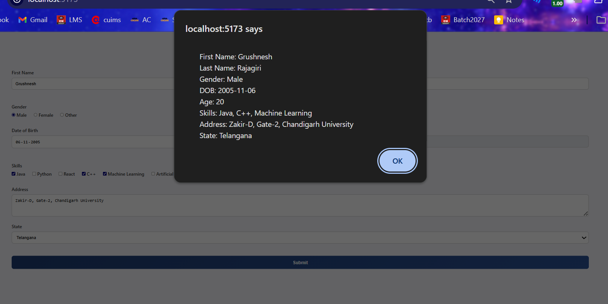
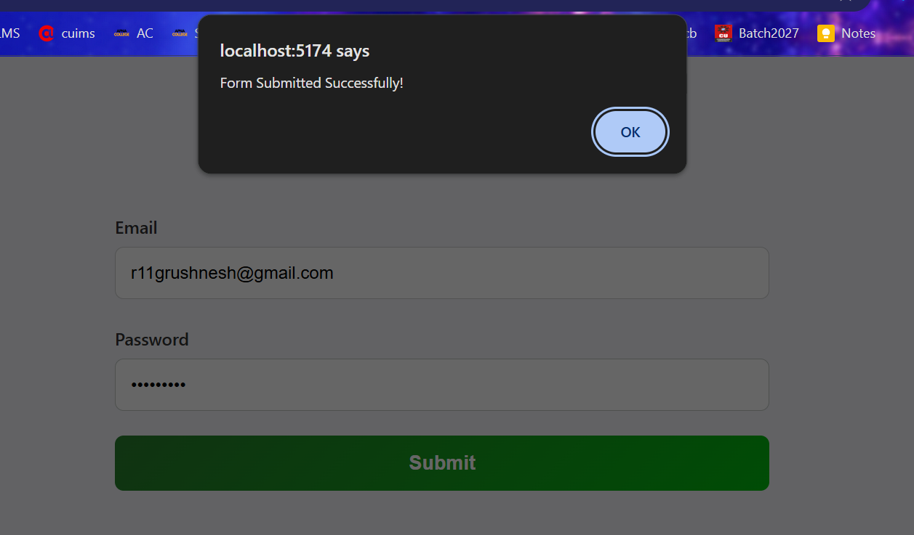
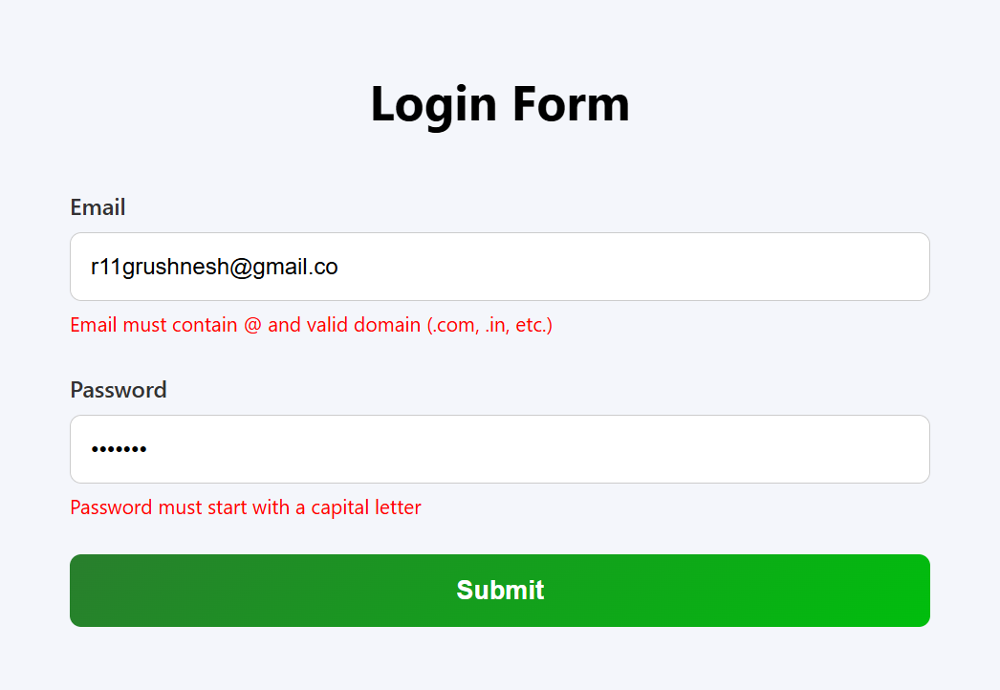
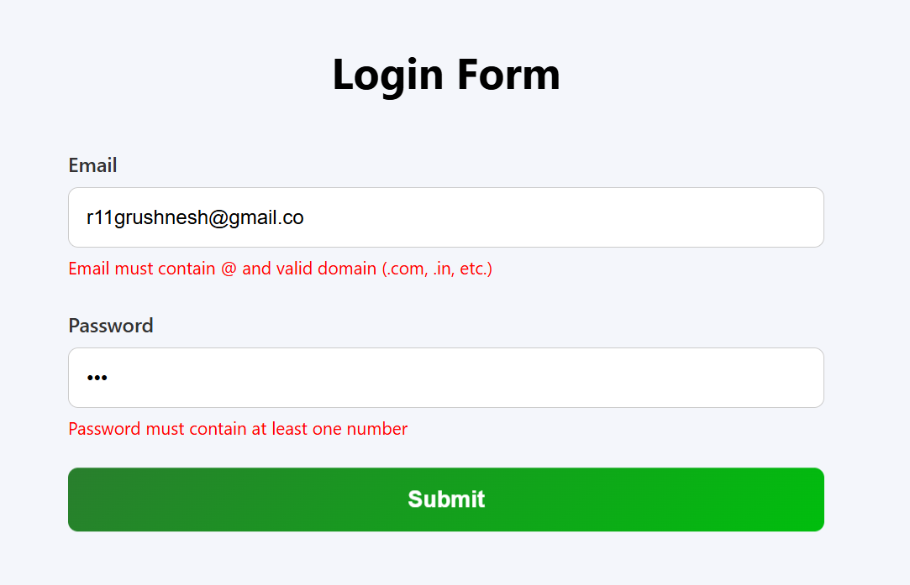
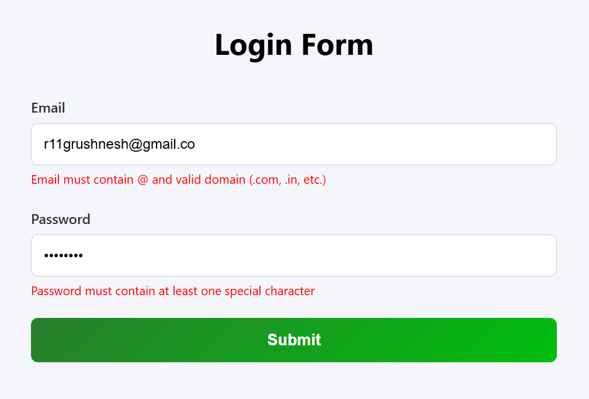

# React Forms and Validation Experiments

---

# Experiment–1: Handling Forms Using Controlled Components

## Objective
To create and manage form inputs in React using controlled components.

## Description
This experiment implements a Registration Form using React controlled components. All input fields are managed using the `useState` hook. The form dynamically calculates the user's age based on the selected Date of Birth and prevents invalid inputs such as future dates or negative age.

## Features
- First Name & Last Name (side-by-side layout)
- Gender (Radio Buttons)
- Date of Birth with auto-calculated Age
- Skills (Multiple Checkboxes)
- Address (Textarea)
- State Dropdown (All Indian States & Union Territories)
- Prevention of future DOB selection
- Full-width responsive UI

## Screenshots

  
  

## Concepts Used
- Controlled Components
- `useState` Hook
- Event Handling (`onChange`, `onSubmit`)
- Conditional Logic
- Dynamic Rendering
- Basic Form Validation

## Outcome
Learned how to handle and manage form inputs using controlled components and React state effectively.

---

# Experiment–2: Client-Side Form Validation

## Objective
To validate form inputs on the client side before submission.

## Description
This experiment implements a Login Form with Email and Password validation using Regular Expressions. Error messages are displayed dynamically, and form submission is allowed only when all validation conditions are satisfied.

## Validation Rules

### Email
- Must contain `@`
- Must end with `.com`, `.in`, or valid country code

### Password
- Must start with a capital letter
- Must contain at least one number
- Must contain at least one special character
- Must be at least 5 characters long

## Concepts Used
- Client-Side Validation
- Regular Expressions (Regex)
- Error State Management
- Conditional Rendering
- Preventing Default Form Submission

## Screenshots

  
  
  
  

## Outcome
Gained practical understanding of implementing client-side validation in React and ensuring correct user input before form submission.